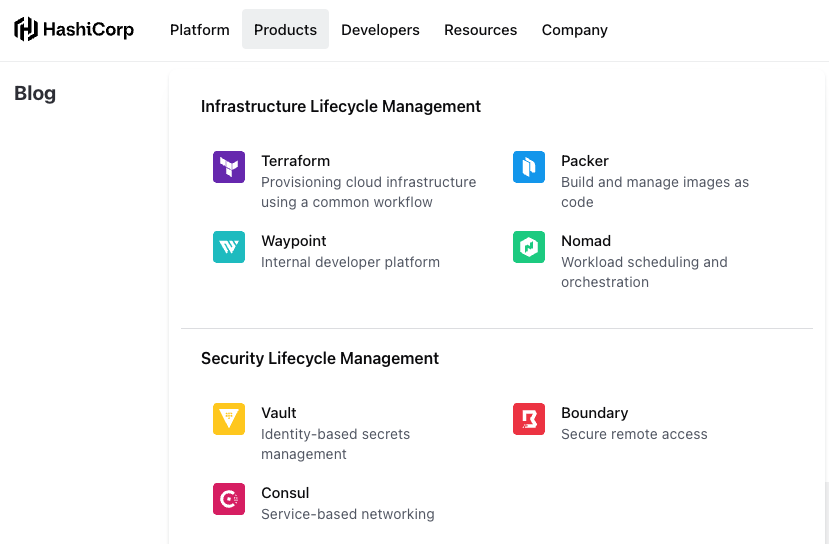
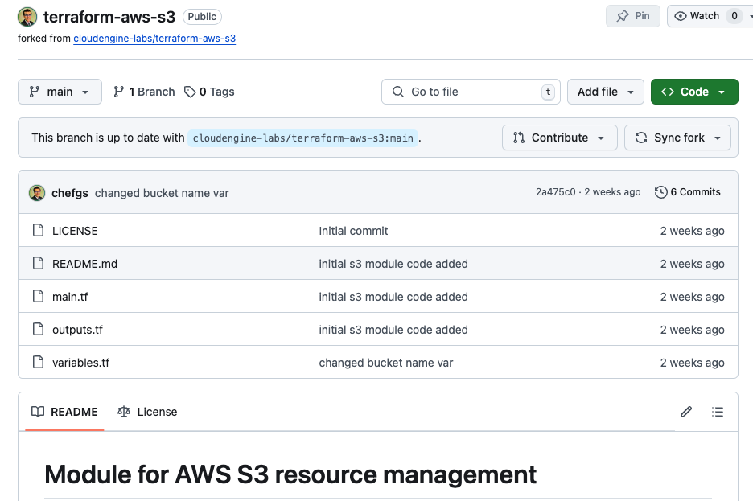

# Redefining Platform Engineering with HashiCorp Cloud Platform (HCP) Waypoint and Terraform 

This Tutorial focuses on explaining the concept of HashiCorp Infrastructure Cloud and How the HCP suit of tools can be helpful in automating the Day 0, Day 1 and Day 2 of Infrastructure Life Cycle management

## Introduction: The Concept of HashiCorp Infrastructure Cloud

Managing infrastructure has often required using individual command-line tools to handle different aspects like security, provisioning, deployment, and monitoring. 

What if there was a unified platform that allows us to manage everything in one place?

HashiCorp worked on this request from clients & practitioners and developed the HashiCorp Cloud Platform (HCP). 

The concept of Infrastructure Cloud is powered by HashiCorp Cloud Platform - HCP. It provides a suite of tools that cater to supports all aspects **Infrastructure Life Cycle management** and **Security Life Cycle management** from _Day 0_ (initial setup), _Day 1_ (ongoing deployment), to _Day 2_ (post-deployment operations). 

---

<div style="text-align: center;">
  
</div>

---

> This suite of HCP tools makes life easier for **developers and platform engineers** by providing everything needed to build, deploy, and maintain infrastructure seamlessly.

### Illustration of Infra Lifecycle Management 

<div style="text-align: center;">
  
</div>

---

> In this tutorial, we will explore two essential tools within HCP: **HCP Waypoint** and **HCP Terraform**. Together, they provide a powerful combination to help automate **infrastructure lifecycle management**. 

By leveraging Terraform's infrastructure as code capabilities and Waypoint's application deployment, you can automate and streamline the entire infrastructure lifecycle seamlessly.

### Scenario Discussed: 

Ease-up the AWS S3 bucket creation when a developer needs to create it. We will see how to do it.

## Tutorial Overview: HCP Waypoint and HCP Terraform

In this session, we'll learn how HCP Waypoint and HCP Terraform work hand-in-hand to facilitate infrastructure deployment, by using the following steps:

1. **Create a Terraform GitHub Repository for the Module**
2. **Create a No-Code Terraform Module using the GitHub Repository**
3. **Create a Version-Control-Based Workspace in HCP Terraform and Connect it to VCS (Version Control System)**
4. **Configure Waypoint to Use the Terraform Module**
5. **Run the Module in HCP Waypoint and Deploy Applications**
6. **Monitor Terraform Run and Application Deployment in HCP Consoles**

### Step 1: Create a GitHub Repository for a Terraform Module

- Start by creating a new GitHub repository to store your Terraform code. This repository will act as the central place to define the infrastructure using Terraform.
  
  Example repository structure:
  ```bash
  ├── main.tf
  ├── variables.tf
  ├── outputs.tf
  └── README.md
  ```

- If you have modules in your GitHub repo or Org GitHub repo you can configure it to enable access to HCP Terraform.

#### S3 Module Project

This is a link to my [GitHub Repository](https://github.com/chefgs/terraform-aws-s3).

<div style="text-align: center;">
  
</div>

### Step 2: Create a No-Code Terraform Module

- HCP Terraform Structure, it contains Org > Project > Workspaces
  - Workspaces is similar to Terraform CLI workspace to handle isolation between environment workspaces

- Once the repository is created, head over to the **HCP Terraform** console.
- Select the `Registry > Publish` option from the dashboard to select the repo from GitHub to create a no-code module.
- Import your Terraform code from the GitHub repository created in the previous step.
- While creating the Registry choose the option "`Add no-code Provisioning`" _check-box_ (This requires HCP Terraform Plus subscritpion)
- Finally create the registry as `no-code` module and publish it
  
  > The **No-Code Module** feature in HCP Terraform allows you to set up infrastructure without having to write code each time, making it accessible for developers as well to provision infra.

### Step 3: Create a Version-Control-Based Workspace

- In the HCP Terraform console, create a new workspace using the "Provision Workspace" button in **Published** module registry
- If required configure the input varibales using **Configure Settings** section
- Connect the workspace to your version control system (VCS) by selecting **GitHub** and choosing the Terraform repository you created earlier.
- Now, configure the workspace to track changes in the repository and automatically trigger runs when updates are made to the code.

### Step 4: Configure HCP Waypoint Template

- HCP Tools Structure, it contains HCP Org > Projects > HCP Waypoint
  - Under waypoint, it contains Templates, Add-ons and Apps

- Go to the **HCP Waypoint** console in the HCP dashboard.
- Click on the **"Templates"** option and create a new template.
- When creating the template, select the **No-Code Terraform Module** that you added to the HCP Terraform in the previous step. This will enable Waypoint to deploy applications based on the infrastructure defined by your Terraform code.

### Step 5: Run the Terraform Module in Waypoint

- From the **Waypoint** console, select the newly created template and click on **"New Run"** to execute the Terraform module.
- The module will automatically deploy the infrastructure specified in your Terraform repository and initiate application deployment.

### Step 6: Create a New Application in HCP Waypoint

- In Waypoint, create a new application by following the prompts after the Terraform run is complete.
- Select the **template** you configured and provide the necessary parameters to set up your application.
- Waypoint will now handle the application lifecycle, including building, deploying, and releasing the application.

### Step 7: Monitor and Verify the Deployment

- After running the Terraform module and deploying the application, you can monitor the progress and logs in both the **HCP Terraform** and **HCP Waypoint** consoles.
- Ensure the infrastructure and application were created successfully, and follow any output or logs to debug issues if they arise.

## Developer Instructions

- Once the infrastructure and applications are successfully deployed, share relevant instructions with developers for future changes and updates. For example, if developers need to make updates to the application, they should push changes to the GitHub repository, triggering an automated deployment via HCP Waypoint.

## Conclusion

With HCP Waypoint and HCP Terraform, you can easily automate both infrastructure management and application deployment. HCP Terraform handles infrastructure automation, while HCP Waypoint simplifies application deployment and management. By following this tutorial, you can quickly set up a robust workflow that automates the entire process from infrastructure provisioning to application deployment.

By using the **No-Code Terraform Module** and **HCP Waypoint Template**, you enable your team to deploy infrastructure and applications faster and with fewer errors, all while reducing the technical complexity required to manage modern infrastructure.

## Next Steps

- Explore the HCP Waypoint and Terraform documentation for advanced features like custom modules and multi-cloud deployments.
- Try integrating HCP Vault or HCP Consul to enhance security and networking within your infrastructure.
- Experiment with scaling applications in different environments (e.g., production and staging) using the same infrastructure code.

---

### Further References

- [HCP Cloud Console](https://portal.cloud.hashicorp.com/)
- [HCP Terraform](https://app.terraform.io/)
- [Infrastructure Cloud Blog](https://www.hashicorp.com/blog/introducing-the-infrastructure-cloud)
- [Armon Explains What is Infrastructure Cloud](https://www.youtube.com/watch?v=1s7GHoyrYYQ) and How it helps for ILM and SLM
